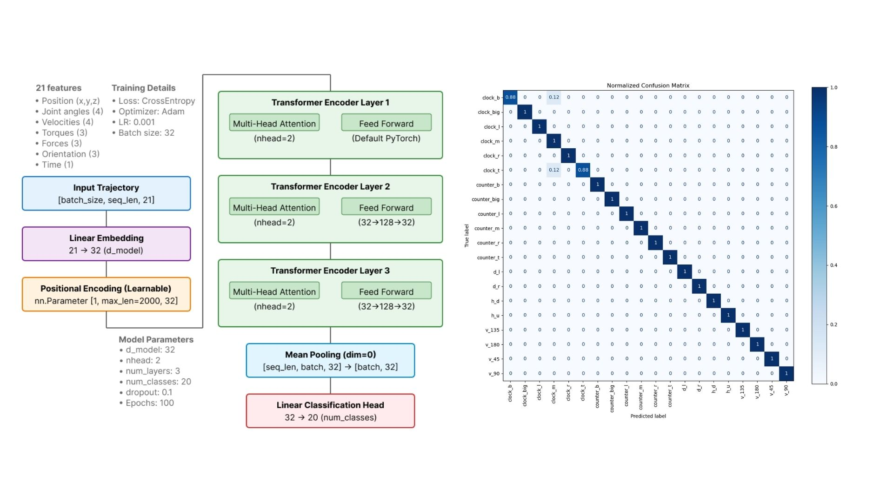
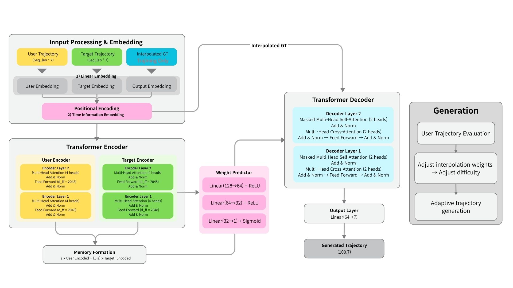
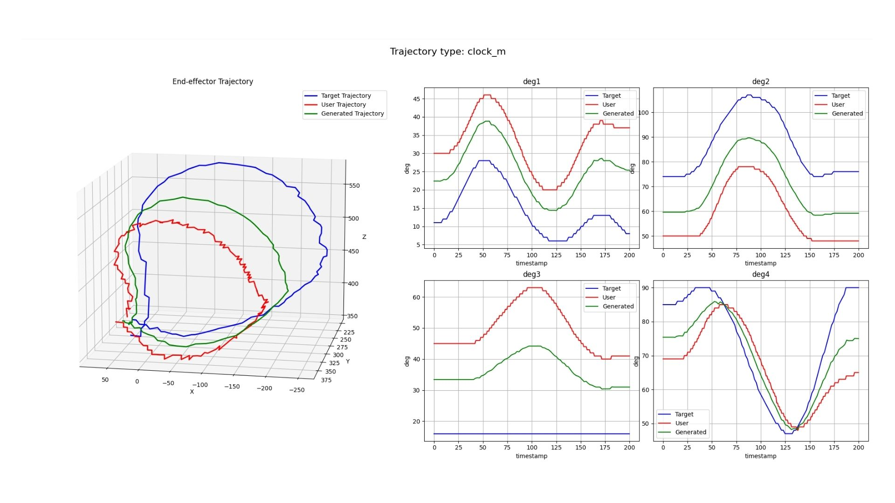
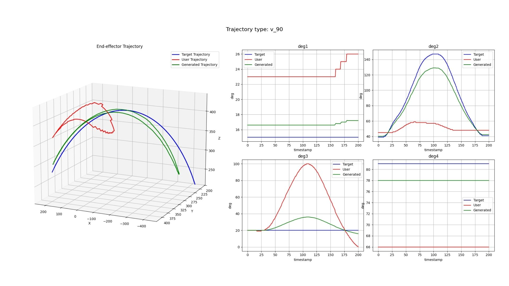
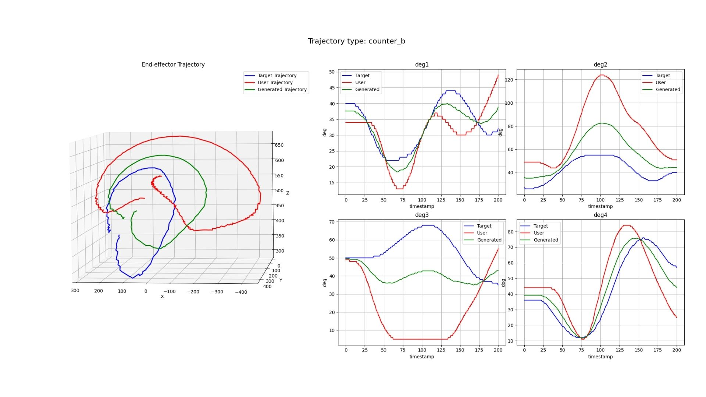
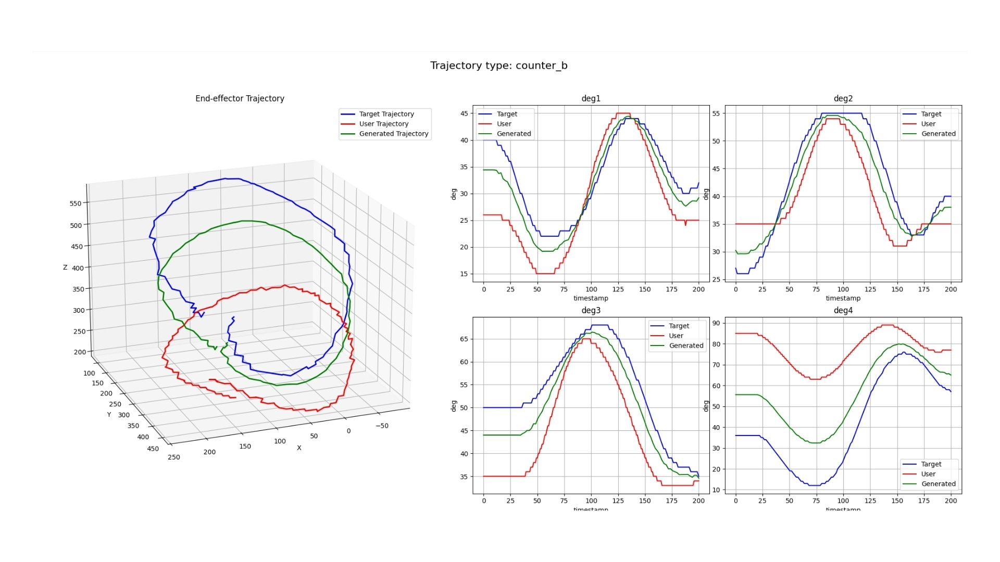
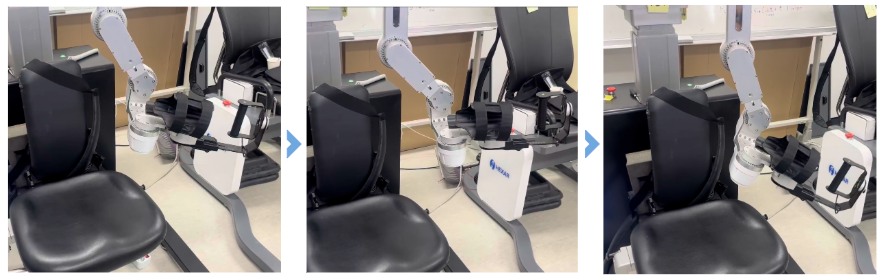
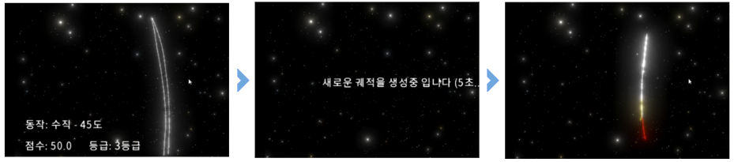

# 2025 Hanyang University ERICA Software Convergence College Capstone Fair
This project, titled **“Artificial Intelligence Algorithm for Generating Upper-Limb Rehabilitation Exercises and Routines”** was developed by Team U30A from the Department of Artificial Intelligence, College of Software and Convergence, Hanyang University ERICA, and was submitted to the 2025 Spring Capstone Design Fair.
The team consists of Nayoung Lee (Student ID: 2022022160) and Dohun Kwak (Student ID: 2022083936), and the project was conducted in industry–academic collaboration with Hexar Human Care Co., Ltd.

This repository is part of a joint project with the [**capstone_unity**](https://github.com/KDohoon/capstone_unity) repository.

## Requirements

This project is developed using Python 3.10. Please upgrade the basic packages compatible with Python 3.10 before installing the requirements.txt.
```python
pip install --upgrade pip setuptools wheel
```
~~~python
pip install -r requirements.txt
~~~

Also, run the following command to use PyTorch with CUDA:
~~~python
pip install torch torchvision torchaudio --extra-index-url https://download.pytorch.org/whl/cu116
~~~


## Table of Contents
- [Background](#background)
- [Goal](#goal)
- [Data Preprocessing](#data-preprocessing)
- [Trajectory Classification](#trajectory-classification)
- [User Evaluation Metrics](#user-evaluation-metrics)
- [Trajectory Generation](#trajectory-generation)
- [Interactive Tutorial](#interactive-tutorial)
- [Conclusion](#conclusion)

----

## Background
South Korea's aging index continues to rise, and according to Statistics Korea data, the aging index has gradually increased from 2020 to 2025. This trend has drawn our attention to stroke, a disease that primarily affects the elderly population.

Stroke causes nerve damage that restricts upper limb movement, particularly shoulder mobility, making upper limb rehabilitation exercises essential for recovery. However, current shoulder rehabilitation programs operate with standardized approaches that fail to adequately consider individual patients' exercise performance capabilities.

Therefore, **this project aims to develop an AI-based personalized rehabilitation system to effectively support upper limb functional recovery for stroke patients.**

----

## Goal
1. **Rehabilitation Exercise Trajectory Classification and Recognition**: Understand the continuity of movement patterns and develop algorithms that consider joint-specific exercise characteristics.
2. **Exercise Performance Evaluation System**: Evaluate the accuracy and completeness of user trajectories and measure current status.
3. **Adaptive Exercise Trajectory Generation with Difficulty Adjustment**: Generate personalized exercise trajectories based on evaluation results and develop difficulty adjustment algorithms that consider performance capabilities.
----

## Data Preprocessing

In this study, we utilized trajectory data directly collected from Hexar Human Care’s 4-DOF upper-limb rehabilitation robot, U30A. After collecting 21 feature values and converting them into a structured format, we decomposed the robot's end-effector positions and joint angles into individual features, primarily working with 7 key data points. All data were unified into numerical format, and relative sequence values were converted to absolute time to ensure proper chronological ordering of the time-series data.
| **Circle** | **Arc** | **Line** |
|---|---|---|
| clock_b, clock_m, clock_t, clock_big, clock_l, clock_r, counter_b, counter_m, counter_t, counter_big, counter_l, counter_r | h_d, h_u, v_45, v_90, v_135, v_180 | d_r, d_l |

A total of 20 predefined trajectory types were collected. Data was gathered from 16 participants (9 women and 7 men), with each participant performing 100 repetitions per arm, resulting in 2,000 trajectory samples.

----

## Trajectory Classification
<p align="center">
  
</p>

> **Fig 1: Transformer Classification Model Structure and Confusion Matrix**

A Transformer-based classification model was developed to identify the type of trajectory from user input data.
The proposed model utilizes only the Transformer Encoder architecture, which learns the temporal dependencies inherent in trajectory sequences and integrates all time steps across the entire motion to produce a predefined single-class label.

By leveraging the Multi-Head Attention mechanism, the model effectively captures trajectory-specific spatiotemporal patterns and interdependencies, thereby enabling the recognition and classification of motion types based on the global morphological characteristics of the trajectory.
Subsequently, the encoded representations from all time points are aggregated into a unified feature vector, which serves as the basis for final trajectory classification.

----

## User Evaluation Metrics
To assess the user's performance capability and generate appropriate rehabilitation exercise trajectories, evaluation metrics were developed for three types of trajectories: line, arc, and circle. To quantitatively analyze how users performed the trajectories, evaluation was conducted considering the geometric characteristics of the trajectories, focusing on whether the trajectories maintained close proximity to a plane when orthogonally projected in three-dimensional space, with additional evaluation of the unique characteristics of each trajectory type.

* ****Formula Description:****

**$$S_{corr} = 100 - \left(\frac{1}{n} \sum_{i=1}^{n} |S_{ori}| \times 100\right)$$**

- $S_{corr}$: Final accuracy score (0~100 points)
- $n$: Total number of evaluation metrics
- $S_{ori}$: Absolute difference between reference and user values
- $X_i$: i-th user measured value
- $S_i$: i-th reference standard value

> **Note:** $S_{ori} = X_i - S_i$, $X_i$ = i-th user value, $S_i$ = i-th reference value

* **Grading System**

| Grade | Score Range | 
|------|-----------|
| **Grade 1** | 76~100 points |
| **Grade 2** | 51~75 points |
| **Grade 3** | 26~50 points |
| **Grade 4** | 0~25 points |

Using these evaluation results, we dynamically adjust the interpolation weights between the user trajectory and target trajectory. For users with lower performance capabilities, the generated trajectory maintains a shape closer to their current movement pattern, while for users with superior performance, the generated trajectory approaches the ideal target trajectory shape.

----

## Trajectory Generation
<p align="center">
  
</p>

> **Fig 2: E2E Transformer Model Structure**

To generate rehabilitation trajectories that adapt to the user’s motor performance, we designed an End-to-End (E2E) Transformer model.
The model adopts a Dual Encoder architecture, where the user trajectory and the ideal reference trajectory of the same type are provided as paired inputs and encoded independently.
Through positional encoding, the model jointly captures temporal dependencies, end-effector positions, and joint angle features, enabling it to learn both the overall geometric structure and drawing patterns of the trajectory.

During training, interpolated ground-truth values are used to fuse the feature representations of the user and reference trajectories, with multiple weighting strategies applied to learn appropriate interpolation patterns.
During inference, the model performs autoregressive generation without ground-truth supervision, allowing it to produce personalized rehabilitation trajectories tailored to each user’s performance level.

<p align="center">
  
  <br>
  
  
</p>

> **Fig 3: Trajectory Generation Results**

Fig 3 presents the visualization of the 3D end-effector positions and joint angle trajectories of the generated motion.
The red trajectory represents the user’s original motion, the blue trajectory denotes the ideal reference trajectory, and the green trajectory corresponds to the newly generated one.
The generated trajectory demonstrates an intermediate level of difficulty—more challenging than the user’s original trajectory but easier than the ideal reference—reflecting the model’s adaptive generation capability.

<p align="center">
  
</p>

> **Fig 4: Clock_L Motion Test on the U30A Robots**

By applying the generated joint angle trajectories to the U30A robot, we verified that the motions were correctly generated within the robot’s joint range of motion.
This confirms that the proposed system can generate adaptive upper-limb rehabilitation trajectories that respond to the user’s performance while respecting the hardware’s physical constraints.

----

## Interactive Tutorial
<p align="center">
  
</p>

> **Fig 5: Interactive Tutorial User Guide Screen**

After visualizing the generated rehabilitation trajectories, we developed a Unity-based interactive tutorial that displays each user’s score and performance grade, allowing users to observe and follow the generated exercises directly.
To enhance engagement, a “connect-the-stars” concept was applied to the tutorial, where users trace the trajectory path interactively.
The starting and ending points of each trajectory are clearly marked in red and yellow, respectively, to help users easily identify the direction and flow of the motion.

----

## Conclusion
Finally, we implemented a personalized trajectory generation model that communicates with the robot in real time to verify that trajectories are correctly generated.
The system provides visual guidance to help users follow the generated trajectories and creates optimized exercise paths tailored to each individual, enabling a more engaging and personalized rehabilitation experience.
In future work, we plan to incorporate continuous self-regressive tracking into the model’s training process to dynamically assess user progress and gradually adjust exercise difficulty, thereby enhancing user motivation throughout the rehabilitation process.
